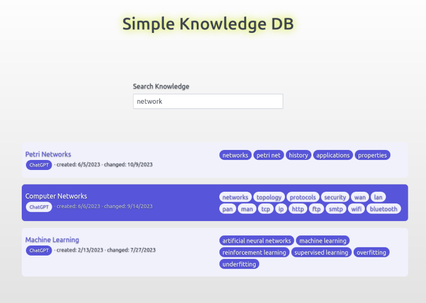

# SimpleKnowledgeDB

A very basic and simple solution to host a knowledge database as markdown files in a git repository.



## Introduction

While there are various solutions for knowledge management available, nothing beats the simplicity of having knowledge database files in `git`. The only drawback for knowledge stored in markdown files is the non optimal search. The goal of this project is to make an easily searchable, easily to setup knowledge database based on git. Without any further infrastructure needed.

This repository consists of a `python` script for creating the search data and an `html` file for starting the search interface.

## Installation

Just copy the files from the `search` folder to your local knowledge base repository. Then execute the python script to generate the search:

```bash
$: cd ./search
$: python generate_search_data.py -i ../knowledgedocs -d https://github.com/bbrosint/SimpleKnowledgeDB/blob/dev/knowledgedocs
```

The `-i` argument is for telling the script where the files lie locally. The `-d` argument is for having all hyperlinks in the search pointing to a remote repository with markdown preview.
If both arguments will be omitted, `./knowledgedocs` will be used for both.

## Usage

A quick and basic usage:

After setting up the search data, open [search/knowledgeDataBase.html](./search/knowledgeDataBase.html) in a web browser and type a search phrase into the input field. By clicking on the item's title, the link to the document will be followed.

## Contributing

Contribution is appreciated for further development of features

## License

The contents of this repository are licensed with the [AGPL license](./LICENSE).

## Authors and history

Main - Sebastian Brede

## Acknowledgments

design template: [spectre.css by Yan Zhu (picturepan)](https://picturepan2.github.io/spectre)
